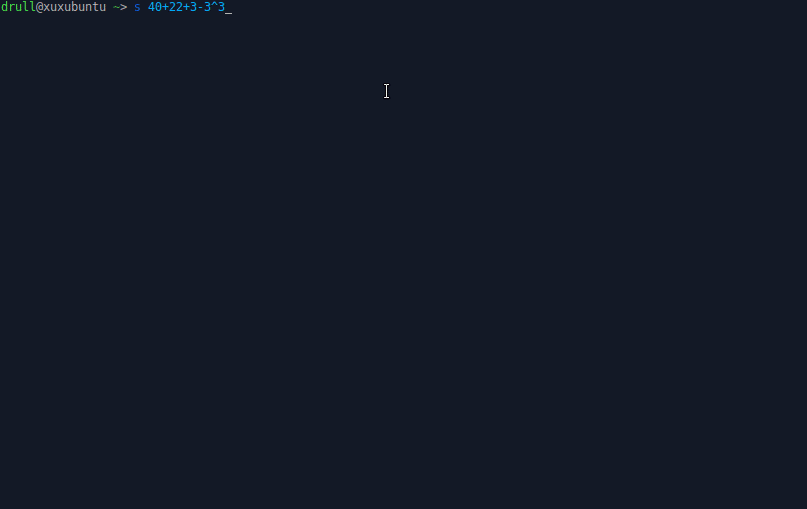

# SpeedLine

SpeedLine is a command-line tool designed to deliver fast and efficient results right from your terminal. With SpeedLine, you can swiftly evaluate mathematical expressions, perform prompt-based searches, and even open URLs directly from the command line. It combines the power of mathematical expression evaluation, web search, and seamless browser integration to enhance your productivity. SpeedLine provides a streamlined and convenient way to handle mathematical computations and conduct quick web searches without leaving your terminal.



## Features

- **Math Expression Evaluation**: Evaluate mathematical expressions with speed and accuracy.
- **Prompt-Based Searches**: Conduct prompt-based searches from the command line.
- **Seamless Browser Integration**: Seamlessly open URLs directly within your default browser.
- **Efficiency and Productivity**: Designed for efficiency and productivity in terminal-based workflows.
- **Easy-to-Use Interface**: Simple command-line arguments for ease of use.
- **Fast and Reliable**: Ensures rapid results with reliable performance.

The default broser is Firefox and the default search engine is DuckDuckGo.

## Usage

To use SpeedLine, simply enter the desired input as a command-line argument. The program will determine if it is a mathematical expression, a prompt for web search, or a URL. The corresponding action will be executed, providing you with the results you need quickly.


## Installation

To install SpeedLine, follow these steps:

1. Clone the repository:

```git clone https://github.com/drull1000/SpeedLine.git```

2. Navigate to the project directory:

```cd SpeedLine```

3. Install the dependencies:

```go mod install```

4. Build the binary:

```go build -o SpeedLine```

5. Add the binary to your system's PATH for convenience. You can also bind a specific key to run the program (if you see the gif, you'll see that mine is the letter "s").

## Contributing

Contributions are welcome! If you have any ideas, enhancements, or bug fixes, feel free to open an issue or submit a pull request.

## License

This project is licensed under the [GPLv3 License](LICENSE).